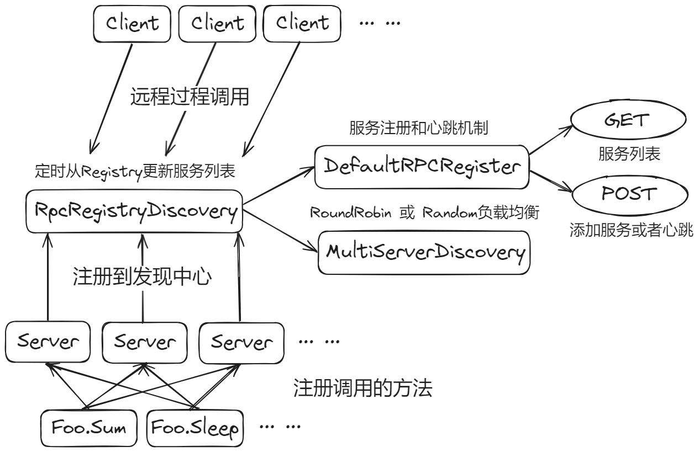
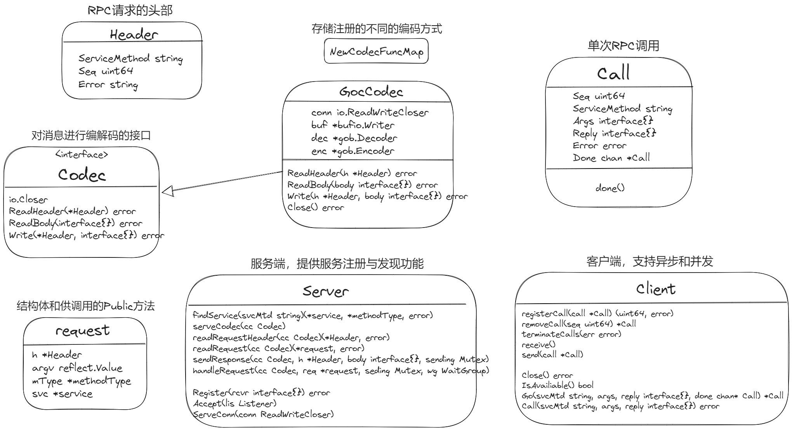
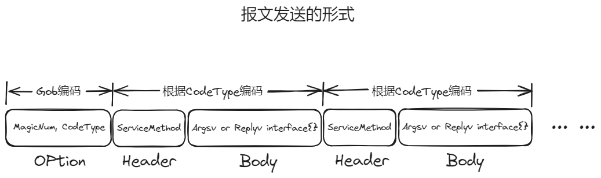

<!--
 * @Author: bz2021
 * @Date: 2023-12-18 17:20:11
 * @Description:  
-->

# 概述

- 从零实现了 `net/rpc` 包，具有基本调用功能
- 支持通过**不同的编码格式**进行序列化和反序列化
- 高性能客户端，支持**并发**和**异步**请求
- 支持客户端和服务端的**超时处理**
- 具有**注册中心**，通过心跳机制进行健康检查
- 具有**服务发现**功能，支持多种**负载均衡**算法

# 流程



# 项目类图



# 模块介绍

## 消息编码

在此模块中，使用了`encoding/gob`包进行消息的序列化和反序列化，其是一个用于在Go语言间进行消息编解码的包，可以将结构体转为二进制形式的编码。

一般以如下的方式发起一个RPC调用

```
err = client.Call("Arith.Multiply", args, &reply)
```

客户端发送的请求包括服务名Service、方法名Method、参数Args；服务端相应包括错误Error、返回值Reply，在此将Service、Method、Error放入到Header中，其他的放在Body中，在Header中另外还有Seq用于区分不同的请求。

## 服务端

在服务端处理收到的请求，在一个conn过来之后，会先解析Option，其是一个由Json编码的结构体，包含Magic Number和Codec Type，用于判断之后的解码通过什么方式。

然后就是调用对应的的Codec（类似工厂模式）的接口进行消息的解码。

消息返回时会加锁防止报文间出现错误。

## 客户端

### Call

该部分设计参考了`net/rpc`，一个函数可以被远程调用，需要满足：

- 这个方法的类型是可导出的
- 这个方法是可导出的
- 这个方法有两个参数，都需是可导出的（或者内置的）类型
- 这个方法的第二个参数是指针
- 这个方法返回错误类型

在一个Call中，包含了上文中提到的字段，另外为了支持异步调用，还有一个chan用来在结束时通知调用方。

### Client

在Client结构体中，会维护一些必要的字段

- 编解码器，和服务端类似
- 互斥锁，保证有序发送
- header，可以复用
- seq，用于分配给Call的序列号
- 未处理完的请求的map，key是seq，value是Call类型
- close、shutdown，都用来表示Client可用状态

Client可以通过`Dial`函数创建，建立连接之后创建出Client

而后可以通过`Call`函数发起一个RPC请求，`Call`函数会封装好对应的`Call`结构体，然后通过`Write`函数发送，之后会阻塞在Done chan上，直到得到Server的回复。

## 服务注册

为了实现将一个Method注册为服务，需要借助反射机制。

首先通过定义一个结构体来保存注册的方法的完整信息，包括`Method`名，第一个参数、第二参数。

然后定义服务的信息结构体，包含`Service`名，自身的`reflect.Type`和`Value`，以及一个`map`存储对应的方法。

最后实现`call`方法使得其可以通过反射调用对应的方法来获取结果。

然后实现`Register`方法用于将struct注册到服务中。

## 超时处理

### 客户端超时

- 创建连接时超时：通过`net.DialTimeout`进行处理
- Call超时：通过`context的WithTimeout` + `select`机制进行处理

### 服务端超时

通过`select + chan + time.After()`进行处理

## HTTP模块

# 遇到的问题和解决方法

## 传输 JSON 格式数据时 TCP Socket 粘包问题



客户端在与服务端建立连接时执行 Dial 函数，会先将 Option 发送过去，这是协议交换阶段

``` go
type Option struct {
	MagicNumber    int
	CodecType      codec.Type
	ConnectTimeout time.Duration
	HandleTimeout  time.Duration
}

json.NewEncoder(conn).Encode(opt);
```

服务端执行 Accept 时会通过以下代码将其解析出来
``` go
json.NewDecoder(conn).Decode(&opt);
```

而后会进入 RPC 消息阶段，执行读取 Header 和 Body 的操作
``` go
err := cc.ReadHeader(&h);
```

在此过程中，如果客户端发送的 Option 数据没有被服务端及时接收，会和 Header 连在一起

json.Decoder 在执行时会将数据加载到缓存区，可能会影响 gob.Decoder 的执行

为了解决这个问题，我们将 Option 也通过 gob 的形式进行编码

实践验证，没有再出现相同的错误

## Goroutine 泄露问题

以下代码执行时，如果 `<-time.After(timeout)` 超时，则会导致 Goroutine 泄露

``` go
func (server *Server) handleRequest(cc codec.Codec, req *request, sending *sync.Mutex, wg *sync.WaitGroup, timeout time.Duration) {
	defer wg.Done()
	called := make(chan struct{})
	sent := make(chan struct{})
	go func() {
		err := req.svc.call(req.mtype, req.argv, req.replyv)
		called <- struct{}{}
		if err != nil {
			req.h.Error = err.Error()
			server.sendResponse(cc, req.h, invalidRequest, sending)
			sent <- struct{}{}
			return
		}
		server.sendResponse(cc, req.h, req.replyv.Interface(), sending)
		sent <- struct{}{}
	}()

	if timeout == 0 {
		<-called
		<-sent
		return
	}
	select {
	case <-time.After(timeout):
		req.h.Error = fmt.Sprintf("rpc server: request handle timeout: expect within %s", timeout)
		server.sendResponse(cc, req.h, invalidRequest, sending)
	case <-called:
		<-sent
	}
}
```

解决方法是再通过一个通道来通知协程关闭

``` Go
finish := make(chan struct{})

go func() {
	err := req.svc.call(req.mtype, req.argv, req.replyv)
	select {
	case <-finish:
		close(called)
		close(sent)
		return

// 省略部分代码

select {
case <-time.After(timeout):
	req.h.Error = fmt.Sprintf("rpc server: request handle timeout: expect within %s", timeout)
	server.sendResponse(cc, req.h, invaildRequest, sending)
	finish <- struct{}{}
case <-called:
	<-sent
}

```

# 参考资料

https://geektutu.com/
